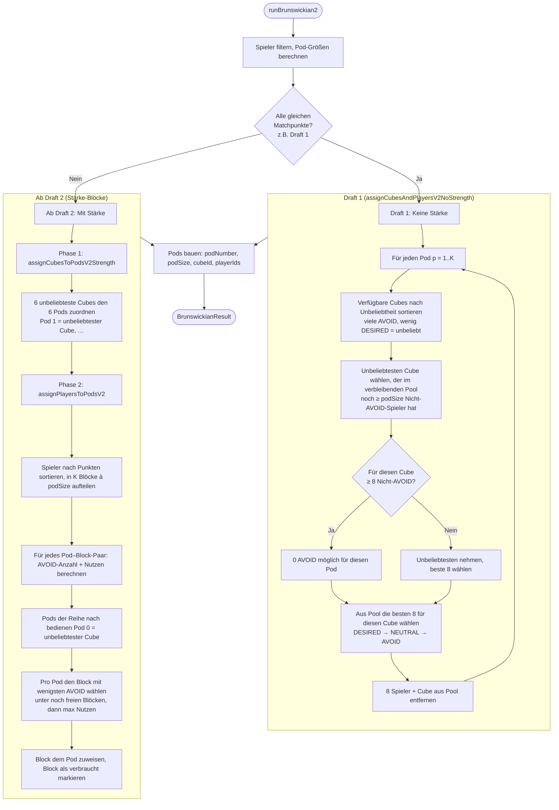

# Brunswikian 2.0 – Ablauf

**Prioritäten (alle Drafts):**  
1. Max DESIRED, wenn irgendmöglich niemand AVOID  
2. Tie-Breaker: unter gleichen (DESIRED, AVOID) die global unbeliebtesten Cubes verwenden  

---

---

## Kurzfassung

| Schritt | Draft 1 (alle gleichen Punkte) | Ab Draft 2 (Stärke) |
|--------|---------------------------------|----------------------|
| **Cube–Pod** | Pro Pod: unbeliebtester Cube, der noch ≥8 Nicht-AVOID im Pool hat | 6 unbeliebteste Cubes → Pod 1..K |
| **Spieler–Pod** | Pro Pod: beste 8 (DESIRED, NEUTRAL, AVOID) für diesen Cube aus Pool | Stärke-Blöcke → Pods; min AVOID, max DESIRED; unbeliebte Cubes zuerst bedient |
| **Tie-Breaker** | Unbeliebteste Cubes zuerst wählen, solange 0 AVOID möglich | Unbeliebteste Cubes für Pods; pro Pod Block mit wenigsten AVOID |
