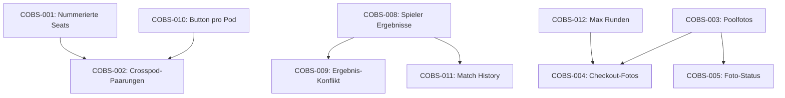

# Stakeholder Wishlist – Tickets

> Erstellt am 26.02.2026 auf Basis der Stakeholder-Wishlist.

---

## COBS-001: Nummerierte Seats im Draftpod

**Priorität:** TBD  
**Komponente:** Draftpod / UI  

**Beschreibung:**  
Jeder Spieler in einem Draftpod soll eine feste, nummerierte Seat-Nummer (1–8) erhalten. Diese Nummer muss sowohl im Admin-Client als auch im Spieler-Client sichtbar sein.

**Akzeptanzkriterien:**
- [ ] Seats im Draftpod sind von 1–8 nummeriert
- [ ] Die Seat-Nummer ist im Admin- und Spieler-Client sichtbar
- [ ] Die Sitzreihenfolge ist nach dem Start des Drafts fixiert

---

## COBS-002: Crosspod-Paarungen in Runde 1

**Priorität:** TBD  
**Komponente:** Pairing-Logik / Backend  

**Beschreibung:**  
Die Paarungen der ersten Runde sollen „Crosspod" sein: Jeder Spieler wird mit dem Seat gepaart, der im Draft-Kreis am weitesten entfernt sitzt. Allgemeine Formel: **Seat N spielt gegen Seat N + (PodGröße / 2)**. Bei ungerader Pod-Größe erhält der Spieler mit dem schlechtesten Standing ein Bye.

**Paarungen nach Pod-Größe:**
| Pod-Größe | Paarungen |
|-----------|-----------|
| 8 Spieler | 1v5, 2v6, 3v7, 4v8 |
| 6 Spieler | 1v4, 2v5, 3v6 |
| 4 Spieler | 1v3, 2v4 |
| Ungerade  | Bye an Spieler mit schlechtestem Standing, Rest nach Formel |

**Akzeptanzkriterien:**
- [ ] Runde-1-Paarungen folgen dem Schema: Seat N vs. Seat N + (PodGröße / 2)
- [ ] Bei ungerader Pod-Größe erhält der Spieler mit dem schlechtesten Standing ein Bye
- [ ] Paarungen werden automatisch beim Start von Runde 1 erstellt
- [ ] Die Logik gilt nur für Runde 1 (spätere Runden nutzen ergebnisbasierte Paarungen)

---

## COBS-003: Poolfotos Pflicht vor Rundenstart (Error bei < 8 Fotos)

**Priorität:** TBD  
**Komponente:** Spieler-Client / Admin-Client / Foto-Upload  

**Beschreibung:**  
Jeder Spieler lädt ein Foto seines Cardpools über den Spieler-Client hoch. Der Start einer Spielrunde soll erst möglich sein, wenn alle 8 Poolfotos hochgeladen wurden. Andernfalls soll eine Fehlermeldung angezeigt werden.

**Akzeptanzkriterien:**
- [ ] Spieler laden ihr Poolfoto selbst über den Spieler-Client hoch
- [ ] Admin kann die Runde nicht starten, wenn weniger als 8 Poolfotos vorliegen
- [ ] Es wird eine aussagekräftige Fehlermeldung angezeigt, die auflistet, wer noch fehlt
- [ ] Nach Hochladen aller Fotos wird der Start-Button aktiv

---

## COBS-004: Checkout-Fotos – Zeitfenster einschränken

**Priorität:** TBD  
**Komponente:** Spieler-Client / Foto-Upload  

**Beschreibung:**  
Nach jedem Draft muss jeder Spieler ein Foto aller von ihm gedrafteten Karten machen und hochladen (Checkout-Foto). Damit kann der Admin verifizieren, dass alle Karten zurückgegeben wurden. Das Hochladen soll erst nach Abschluss der 2. Runde möglich sein und zwingend vor dem Reporting der 3. Runde erfolgen. Spieler sollen beim Versuch, Runde 3 zu reporten, an das Hochladen erinnert werden.

**Akzeptanzkriterien:**
- [ ] Checkout-Foto-Upload ist vor Ende von Runde 2 deaktiviert/nicht sichtbar
- [ ] Ab Ende von Runde 2 wird der Upload freigeschaltet
- [ ] Reporting der 3. Runde ist ohne vorheriges Checkout-Foto nicht möglich
- [ ] Spieler erhält bei fehlendem Foto eine Erinnerung/Fehlermeldung

---

## COBS-005: Foto-Upload-Status nach Rundenstart nicht sichtbar

**Priorität:** TBD  
**Komponente:** Spieler-Client / UI  
**Typ:** Bug / UX-Verbesserung  

**Beschreibung:**  
Nach dem Start der Spielrunde ist für den Spieler nicht mehr ersichtlich, ob seine Bilder (Pool-/Checkout-Fotos) bereits hochgeladen wurden oder nicht.

**Akzeptanzkriterien:**
- [ ] Spieler sehen jederzeit den Upload-Status ihrer Fotos (z.B. Häkchen/Icon)
- [ ] Der Status bleibt auch nach Rundenstart sichtbar
- [ ] Klar erkennbar, welche Fotos noch fehlen

---

## COBS-006: Falsche Bezeichnung „Runde" statt „Draft" im Spieler-Client

**Priorität:** TBD  
**Komponente:** Spieler-Client / UI  
**Typ:** Bug  

**Beschreibung:**  
Im Overview des Spieler-Clients steht „Runde 1" und „Runde 2" anstelle von „Draft 1" und „Draft 2". Die Bezeichnung soll „Draft" sein, da „Runde" für die Spielrunden innerhalb eines Drafts verwendet wird.

**Akzeptanzkriterien:**
- [ ] Im Overview wird „Draft 1", „Draft 2" etc. angezeigt
- [ ] „Runde" wird nur für die Spielrunden innerhalb eines Drafts verwendet
- [ ] Konsistente Terminologie im gesamten Spieler-Client

---

## COBS-007: Rundentimer für Admin und Spieler

**Priorität:** TBD  
**Komponente:** Admin-Client / Spieler-Client / Backend  

**Beschreibung:**  
Es soll ein Timer implementiert werden, der die verbleibende Zeit anzeigt. Der Timer gilt **nur für die Spielrunden (Paarungen)**, nicht für die Draft-Phase an sich. Die Dauer ist konfigurierbar (Default: 50 Minuten). Nach Ablauf der Zeit wechselt die Anzeige auf negative Zeit (rot). Bei 5 Minuten verbleibend wird der Timer gelb/orange als visuelle Warnung.

**Akzeptanzkriterien:**
- [ ] Timer-Dauer ist konfigurierbar (Default: 50 Minuten)
- [ ] Timer gilt nur für Spielrunden (einzelne Paarungen), nicht für den Draft
- [ ] Admins starten den Timer manuell für jede Paarung (kein automatischer Start)
- [ ] Timer ist für Admin und Spieler sichtbar
- [ ] Bei 5 Minuten verbleibend: Timer wechselt auf Gelb/Orange (Warnung)
- [ ] Bei 0:00: Timer zählt ins Negative, Darstellung wird rot
- [ ] Timer synchronisiert sich zwischen allen Clients (serverseitig gesteuert)

---

## COBS-008: Spieler können Ergebnisse melden

**Priorität:** TBD  
**Komponente:** Spieler-Client / Backend  

**Beschreibung:**  
Spieler sollen die Möglichkeit haben, ihre Spielergebnisse selbst über den Spieler-Client zu melden. Das Ergebnis wird als konkretes Game-Ergebnis eingegeben (z.B. 2-0, 2-1, 1-2, 0-2). Draws/Unentschieden sind ebenfalls möglich (z.B. 1-1-1).

**Akzeptanzkriterien:**
- [ ] Spieler können ihr konkretes Game-Ergebnis pro Runde melden (z.B. 2-0, 2-1, 1-2, 0-2)
- [ ] Draw/Unentschieden ist als Ergebnis wählbar
- [ ] Beide Spieler einer Paarung können unabhängig ein Ergebnis melden
- [ ] Gemeldete Ergebnisse sind für den Admin einsehbar
- [ ] Bei übereinstimmenden Ergebnissen wird das Resultat automatisch übernommen

---

## COBS-009: Ergebnis-Konflikt blockiert nächste Runde

**Priorität:** TBD  
**Komponente:** Admin-Client / Backend  

**Beschreibung:**  
Bevor der Admin die nächste Runde starten kann, müssen die von beiden Spielern gemeldeten Ergebnisse übereinstimmen. Bei Unterschieden wird eine Fehlermeldung angezeigt und der Start der nächsten Runde ist nicht möglich.

**Akzeptanzkriterien:**
- [ ] Ergebnisvergleich vor Rundenstart
- [ ] Bei Diskrepanz: Fehlermeldung mit Details (welche Paarung, welche Meldungen)
- [ ] Admin kann die Runde erst starten, nachdem der Konflikt behoben wurde
- [ ] Admin hat Möglichkeit, das korrekte Ergebnis manuell zu setzen

**Abhängigkeit:** COBS-008 (Spieler Ergebnis-Meldung)

---

## COBS-010: Paarungen pro Pod generieren (UI-Änderung)

**Priorität:** TBD  
**Komponente:** Admin-Client / UI  

**Beschreibung:**  
Aktuell gibt es nur einen einzigen Button, der Paarungen für alle Pods eines Drafts gleichzeitig generiert. Stattdessen soll es einen separaten Button pro Pod geben, damit der Admin die Paarungsgenerierung podweise steuern kann.

**Akzeptanzkriterien:**
- [ ] Pro Pod gibt es einen eigenen "Paarungen generieren"-Button
- [ ] Der bisherige globale Button wird entfernt
- [ ] Paarungen werden nur für den ausgewählten Pod erstellt
- [ ] Admin kann Pods unabhängig voneinander starten

---

## COBS-011: Spieler-Client – Nur aktuelle Runde unter Paarungen

**Priorität:** TBD  
**Komponente:** Spieler-Client / UI  

**Beschreibung:**  
Im Spieler-Client soll unter „Paarungen" nur die aktuelle Runde angezeigt werden. Vergangene Ergebnisse sollen in einem zuklappbaren Bereich „Match History" verfügbar sein.

**Akzeptanzkriterien:**
- [ ] Aktuelle Runde ist prominent unter „Paarungen" sichtbar
- [ ] Vergangene Runden erscheinen in einem zuklappbaren „Match History"-Bereich
- [ ] Match History enthält Ergebnisse aller bisherigen Runden
- [ ] Standardmäßig ist die Match History zugeklappt

---

## COBS-012: Maximale Rundenanzahl pro Draft (konfigurierbar, Default 3)

**Priorität:** TBD  
**Komponente:** Backend / Admin-Client  

**Beschreibung:**  
Die maximale Anzahl an Runden pro Draft soll konfigurierbar sein (Default: 3). Nach Erreichen des Maximums soll keine weitere Runde generiert werden können.

**Akzeptanzkriterien:**
- [ ] Maximale Rundenzahl ist konfigurierbar (z.B. beim Turnier-/Draft-Setup)
- [ ] Standardwert ist 3
- [ ] Nach Erreichen des Maximums ist der Button zum Generieren deaktiviert
- [ ] Backend-Validierung verhindert das Überschreiten des Limits
- [ ] Admin erhält Hinweis, dass der Draft abgeschlossen ist

---

## ✅ Alle offenen Fragen geklärt

Alle Stakeholder-Fragen wurden beantwortet und in die Tickets eingearbeitet.

---

## Implementierungsreihenfolge

### Abhängigkeiten

### Phasen

| Phase | Tickets | Begründung |
|-------|---------|------------|
| **1 – Quick Wins** | **COBS-006** (Draft statt Runde), **COBS-012** (Max Runden) | Keine Abhängigkeiten, schnell umsetzbar |
| **2 – Seats & Pairings** | **COBS-001** → **COBS-010** → **COBS-002** | COBS-002 braucht Seat-Nummern und pod-basierte Paarungen |
| **3 – Ergebnis-System** | **COBS-008** → **COBS-009** → **COBS-011** | COBS-009/011 setzen Spieler-Ergebnismeldung voraus |
| **4 – Foto-System** | **COBS-003** → **COBS-005** → **COBS-004** | COBS-004 baut auf Foto-Upload auf, braucht Runde-3-Reporting |
| **5 – Timer** | **COBS-007** | Komplex (Echtzeit-Sync), aber keine Abhängigkeiten – parallel möglich |
